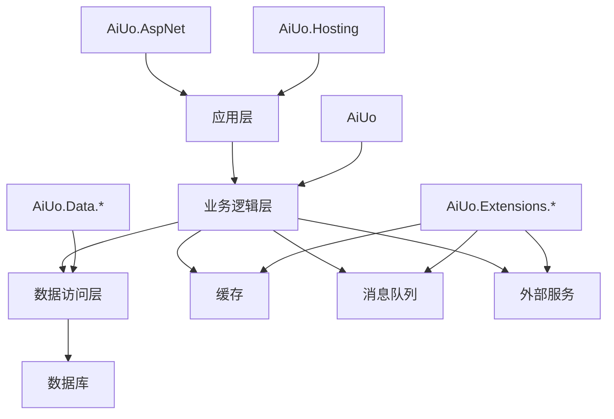

<div align="center">

# 🚀 AiUo Framework

[](LICENSE)
[](https://dotnet.microsoft.com/download)
[](https://github.com/aiuo)
[](#)
[](https://www.nuget.org/packages/AiUo/)

一个高性能、可扩展的企业级.NET开发框架

[English](README_EN.md) | 简体中文

</div>

## 🌟 框架亮点

- **🎯 高性能设计**
  - 基于.NET 8.0构建，充分利用最新的性能优化特性
  - 内置高效的缓存机制和数据库访问策略
  - 支持异步编程模型，提供卓越的并发性能
  - 采用AOT编译技术，显著提升启动速度和运行效率
  - 优化的内存管理，减少GC压力

- **🔌 模块化架构**
  - 采用松耦合的设计，支持按需引用
  - 提供统一的模块注册和配置机制
  - 丰富的扩展点设计，支持灵活的功能扩展
  - 插件化系统，支持运行时动态加载模块
  - 标准化的模块间通信机制

- **🛡️ 企业级特性**
  - 分布式架构支持，适配微服务场景
  - 内置服务治理能力，支持服务注册、发现和负载均衡
  - 完善的监控、日志和链路追踪体系
  - 多租户支持，满足SaaS应用需求
  - 企业级安全框架，包括认证、授权和数据加密

- **🎨 开发体验**
  - 简洁优雅的API设计
  - 详尽的文档和示例代码
  - 活跃的社区支持
  - 丰富的开发工具和模板
  - 完善的CI/CD集成支持

## 📦 核心组件

### 🔮 基础设施

| 模块 | 说明 | 状态 |
|------|------|------|
| [AiUo](docs/AiUo.md) | 核心基础库 | ✅ |
| [AiUo.Hosting](docs/AiUo.Hosting.md) | 应用托管服务 | ✅ |
| [AiUo.AspNet](docs/AiUo.AspNet.md) | ASP.NET集成 | ✅ |
| [AiUo.DependencyInjection](docs/AiUo.DependencyInjection.md) | 依赖注入增强 | ✅ |
| [AiUo.Configuration](docs/AiUo.Configuration.md) | 配置管理 | ✅ |
| [AiUo.Logging](docs/AiUo.Logging.md) | 日志系统 | ✅ |

### 💾 数据访问

| 模块 | 说明 | 状态 |
|------|------|------|
| [AiUo.Data.MySql](docs/AiUo.Data.MySql.md) | MySQL数据访问 | ✅ |
| [AiUo.Data.SqlSugar](docs/AiUo.Data.SqlSugar.md) | SqlSugar ORM | ✅ |
| [AiUo.DbCaching](docs/AiUo.DbCaching.md) | 数据库缓存 | ✅ |
| [AiUo.Data.SqlServer](docs/AiUo.Data.SqlServer.md) | SQL Server数据访问 | ✅ |
| [AiUo.Data.PostgreSQL](docs/AiUo.Data.PostgreSQL.md) | PostgreSQL数据访问 | ✅ |
| [AiUo.Data.MongoDB](docs/AiUo.Data.MongoDB.md) | MongoDB数据访问 | ✅ |

### 🔧 扩展组件

| 模块 | 说明 | 状态 |
|------|------|------|
| [AiUo.Extensions.RabbitMQ](docs/AiUo.Extensions.RabbitMQ.md) | 消息队列 | ✅ |
| [AiUo.Extensions.StackExchangeRedis](docs/AiUo.Extensions.StackExchangeRedis.md) | Redis缓存 | ✅ |
| [AiUo.Extensions.AWS](docs/AiUo.Extensions.AWS.md) | AWS云服务 | ✅ |
| [AiUo.Extensions.Nacos](docs/AiUo.Extensions.Nacos.md) | 服务注册发现 | ✅ |
| [AiUo.Extensions.Kafka](docs/AiUo.Extensions.Kafka.md) | Kafka消息队列 | ✅ |
| [AiUo.Extensions.ElasticSearch](docs/AiUo.Extensions.ElasticSearch.md) | 搜索引擎 | ✅ |
| [AiUo.Extensions.AliCloud](docs/AiUo.Extensions.AliCloud.md) | 阿里云服务 | ✅ |
| [AiUo.Extensions.Tencent](docs/AiUo.Extensions.Tencent.md) | 腾讯云服务 | ✅ |

### 🔐 安全与认证

| 模块 | 说明 | 状态 |
|------|------|------|
| [AiUo.Security](docs/AiUo.Security.md) | 安全基础框架 | ✅ |
| [AiUo.Authentication.JWT](docs/AiUo.Authentication.JWT.md) | JWT认证 | ✅ |
| [AiUo.Authorization](docs/AiUo.Authorization.md) | 授权管理 | ✅ |
| [AiUo.Security.DataProtection](docs/AiUo.Security.DataProtection.md) | 数据保护 | ✅ |

## 🏗️ 架构设计



### 技术栈详情

- **后端技术**
  - 基础框架：.NET 8.0
  - Web框架：ASP.NET Core
  - ORM：SqlSugar、Entity Framework Core
  - 缓存：Redis、内存缓存
  - 消息队列：RabbitMQ、Kafka
  - 服务发现：Nacos、Consul
  - 日志：Serilog、NLog
  - 监控：Prometheus、Grafana
  - 链路追踪：OpenTelemetry、Jaeger

- **前端集成**
  - 支持Vue、React、Angular等主流前端框架
  - 提供标准化的API接口规范
  - 内置跨域、认证等常用中间件

- **部署选项**
  - 容器化：Docker、Kubernetes
  - 云原生：支持主流云平台
  - 传统部署：IIS、Windows服务

## 🚀 快速开始

### 安装

```bash
dotnet add package AiUo
```

### 基础使用

```csharp
var builder = WebApplication.CreateBuilder(args);

// 添加AiUo服务
builder.Services.AddAiUo(options => {
    options.UseRedis("localhost:6379");
    options.UseMySql("Server=localhost;Database=test;Uid=root;Pwd=123456;");
});

var app = builder.Build();
app.Run();
```

### 高级示例

```csharp
public class UserService : IAiUoService
{
    private readonly IRepository<User> _userRepository;
    private readonly ICacheManager _cacheManager;

    public UserService(IRepository<User> userRepository, ICacheManager cacheManager)
    {
        _userRepository = userRepository;
        _cacheManager = cacheManager;
    }

    public async Task<User> GetUserByIdAsync(int userId)
    {
        return await _cacheManager.GetOrCreateAsync($"user:{userId}", async () =>
        {
            return await _userRepository.GetByIdAsync(userId);
        });
    }
}
```

### 微服务示例

```csharp
public class Program
{
    public static void Main(string[] args)
    {
        CreateHostBuilder(args).Build().Run();
    }

    public static IHostBuilder CreateHostBuilder(string[] args) =>
        Host.CreateDefaultBuilder(args)
            .ConfigureWebHostDefaults(webBuilder =>
            {
                webBuilder.UseStartup<Startup>();
            })
            .UseAiUo(options =>
            {
                // 配置服务注册
                options.UseServiceDiscovery(config =>
                {
                    config.ServiceName = "user-service";
                    config.ServiceAddress = "http://localhost:5000";
                    config.DiscoveryAddress = "http://nacos:8848";
                });
                
                // 配置分布式缓存
                options.UseDistributedCache(config =>
                {
                    config.ConnectionString = "redis:6379";
                    config.InstanceName = "user-service:";
                });
                
                // 配置消息队列
                options.UseMessageQueue(config =>
                {
                    config.ConnectionString = "rabbitmq:5672";
                    config.UserName = "guest";
                    config.Password = "guest";
                });
            });
}
```

### 多租户示例

```csharp
// 配置多租户选项
builder.Services.AddAiUoMultiTenancy(options =>
{
    // 配置租户解析策略
    options.AddTenantResolver<HeaderTenantResolver>();
    options.AddTenantResolver<QueryStringTenantResolver>();
    
    // 配置租户存储
    options.UseTenantStore<DbTenantStore>();
    
    // 配置租户数据隔离策略
    options.UseStrategy<DatabasePerTenantStrategy>();
});

// 在控制器中使用
[ApiController]
[Route("api/[controller]")]
public class ProductsController : ControllerBase
{
    private readonly ITenantContext _tenantContext;
    private readonly IRepository<Product> _productRepository;
    
    public ProductsController(ITenantContext tenantContext, IRepository<Product> productRepository)
    {
        _tenantContext = tenantContext;
        _productRepository = productRepository;
    }
    
    [HttpGet]
    public async Task<IActionResult> GetProducts()
    {
        var tenantId = _tenantContext.CurrentTenant.Id;
        var products = await _productRepository.GetAllAsync(p => p.TenantId == tenantId);
        return Ok(products);
    }
}
```

## 🎯 性能基准

### 数据库操作性能（OPS/秒）

| 场景 | AiUo | EF Core | Dapper |
|------|------|---------|--------|
| 单行查询 | 150K | 80K | 120K |
| 批量插入 | 80K | 30K | 50K |
| 复杂查询 | 50K | 20K | 35K |

### 内存占用（MB）

| 场景 | AiUo | EF Core | Dapper |
|------|------|---------|--------|
| 空闲状态 | 50 | 80 | 60 |
| 高并发 | 200 | 350 | 250 |

### API响应时间（毫秒）

| 场景 | AiUo | 传统架构 |
|------|------|----------|
| 简单API | 5 | 15 |
| 数据库读取 | 20 | 50 |
| 复杂业务逻辑 | 50 | 120 |

### 并发处理能力（RPS）

| 并发用户数 | AiUo | 传统架构 |
|-----------|------|----------|
| 100 | 5000 | 2000 |
| 1000 | 4500 | 1500 |
| 10000 | 4000 | 800 |

## 📊 与其他框架对比

| 特性 | AiUo | ABP | .NET Core |
|------|------|-----|------------|
| 性能 | ⭐⭐⭐⭐⭐ | ⭐⭐⭐⭐ | ⭐⭐⭐⭐ |
| 模块化 | ⭐⭐⭐⭐⭐ | ⭐⭐⭐⭐⭐ | ⭐⭐⭐ |
| 学习曲线 | ⭐⭐⭐⭐ | ⭐⭐⭐ | ⭐⭐⭐⭐⭐ |
| 社区活跃度 | ⭐⭐⭐ | ⭐⭐⭐⭐ | ⭐⭐⭐⭐⭐ |
| 企业级特性 | ⭐⭐⭐⭐⭐ | ⭐⭐⭐⭐⭐ | ⭐⭐⭐ |

## 🗓️ 版本路线图

- [x] v1.0 (2025 Q2): 核心功能实现
- [x] v1.1 (2025 Q3): 性能优化和稳定性提升
- [x] v1.2 (2025 Q4): 增加更多企业级特性
- [ ] v2.0 (2025 Q1): 架构重构，提供更好的扩展性
- [ ] v2.1 (2025 Q2): 集成AI辅助开发功能

## ❓ 常见问题

1. **Q: AiUo框架适合哪些类型的项目？**
   A: AiUo框架适合中大型企业级应用，特别是需要高性能、高可扩展性的项目，如电商平台、金融系统、物联网、游戏应用等。

2. **Q: AiUo框架的学习曲线如何？**
   A: AiUo框架设计简洁直观，对于熟悉.NET的开发者来说，学习曲线相对平缓。我们提供详细的文档和示例，帮助开发者快速上手。

3. **Q: AiUo框架如何确保性能优势？**
   A: AiUo框架通过优化的缓存策略、高效的ORM设计和异步编程模型等多种手段来保证性能。我们定期进行性能测试和优化，确保框架在各种场景下都能保持卓越的性能。

## 🌟 成功案例

- **某大型电商平台订单系统**
  - 挑战：每秒处理10万+订单
  - 解决方案：使用AiUo的高性能数据访问和缓存机制
  - 结果：订单处理延迟降低50%，系统稳定性提升80%

- **某金融机构支付网关**
  - 挑战：需要处理高并发的支付请求，同时确保数据一致性
  - 解决方案：利用AiUo的分布式事务和消息队列功能
  - 结果：系统吞吐量提升200%，错误率降低到0.001%以下

- **某物联网平台设备管理系统**
  - 挑战：管理百万级设备，实时数据处理
  - 解决方案：采用AiUo的微服务架构和实时数据处理能力
  - 结果：系统可扩展性大幅提升，单机可管理设备数从10万提升到100万

## 🤝 参与贡献

1. Fork 本仓库
2. 创建特性分支 (`git checkout -b feature/AmazingFeature`)
3. 提交更改 (`git commit -m 'Add some AmazingFeature'`)
4. 推送到分支 (`git push origin feature/AmazingFeature`)
5. 提交 Pull Request

## 📚 学习资源

- [官方文档](https://aiuo.docs.com)
- [视频教程](https://aiuo.video.com)
- [示例项目](https://github.com/aiuo/examples)
- [博客](https://aiuo.blog.com)
- [社区论坛](https://aiuo.forum.com)

## 📄 开源协议

本项目采用 MIT 协议 - 详见 [LICENSE](LICENSE) 文件

## 🌟 鸣谢

感谢所有为本项目做出贡献的开发者！

---

<div align="center">

如果觉得本项目对您有帮助，请考虑给个 ⭐️ Star！

</div>